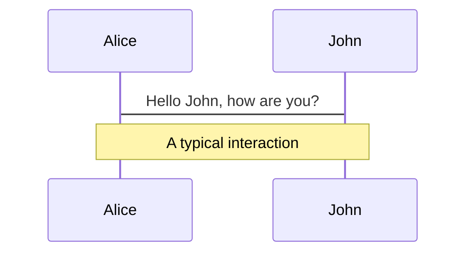
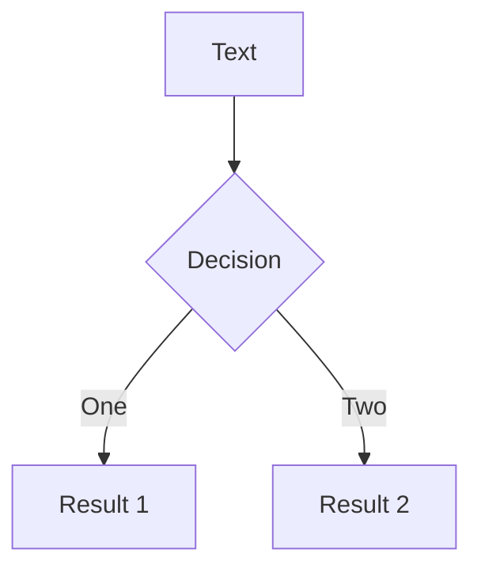
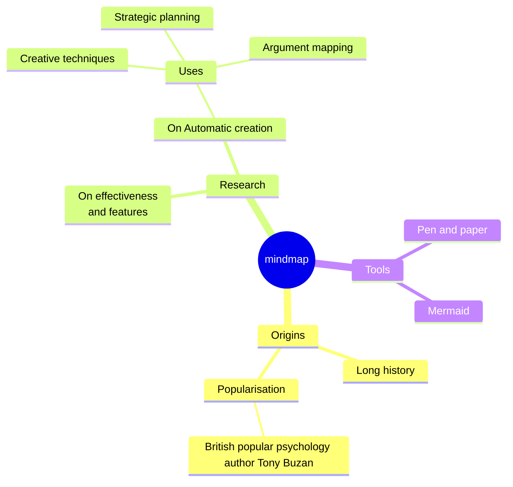
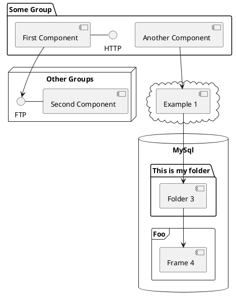

<div class="absolute inset-0 flex flex-col justify-center items-center">
  <h1 class="relative inline-flex items-center">
    <span class="text-black mr-2">🚀</span>
    <span class="bg-clip-text text-transparent" style="background-image: linear-gradient(123deg, #5e4eff 13.15%, #f14eff 88.72%);">
      LLM AI 应用的简单实现方法
    </span>
  </h1>
  <p class="pt-6">如何使用大语言模型 API 构建简单的 AI 应用</p>
</div>

---

<h1 class="relative inline-flex items-center">
  <span class="text-black mr-2">📱</span>
  <span class="bg-clip-text text-transparent" style="background-image: linear-gradient(123deg, #5e4eff 13.15%, #f14eff 88.72%);">
    大语言模型应用
  </span>
</h1>

> 大语言模型（LLM）是一种利用机器学习技术来理解和生成人类语言的人工智能模型。而大语言模型的 AI 应用则是基于这种模型构建的各种应用程序。

<ul class="py-4">
  <li>ChatGPT</li>
  <li>GitHub Copilot</li>
  <li>Notion AI</li>
  <li>...</li>
</ul>

为什么需要基于大语言模型的 AI 应用？

<ul class="pt-4">
  <li>提升生产力</li>
  <li>增强创作</li>
  <li>智能交互</li>
  <li>...</li>
</ul>

---

<h1 class="relative inline-flex items-center">
  <span class="text-black mr-2">🌐</span>
  <span class="bg-clip-text text-transparent" style="background-image: linear-gradient(123deg, #5e4eff 13.15%, #f14eff 88.72%);">
    大语言模型 API
  </span>
</h1>

<p class="pt-6">构建大语言模型 AI 最简单和快速的方式就是直接使用 AI 厂商提供的 API 服务。</p>

<p class="pt-6">常见的 LLM 服务 API 平台：</p>

<ul>
  <li><a href="https://platform.openai.com/docs/api-reference/introduction">OpenAI Platform</a></li>
  <li><a href="https://azure.microsoft.com/en-us/products/ai-services/openai-service">Azure OpenAI</a></li>
  <li><a href="https://ai.google.dev/gemini-api">Google Gemini</a></li>
  <li><a href="https://docs.anthropic.com/en/api/getting-started">Anthropic - Claude</a></li>
  <li><a href="https://platform.moonshot.cn/docs/api/chat#%E5%9F%BA%E6%9C%AC%E4%BF%A1%E6%81%AF">Kimi</a></li>
  <li>通义千问，文言一心</li>
  <li>...</li>
</ul>

---

<h1 class="relative inline-flex items-center">
  <span class="bg-clip-text text-transparent" style="background-image: linear-gradient(123deg, #5e4eff 13.15%, #f14eff 88.72%);">
    使用 OpenAI API
  </span>
</h1>

<p class="pt-6">我们可以通过使用任何语言的 HTTP 请求，或者利用其官方的 Python 包和 Node.js 库，甚至社区维护的库，与 Open AI 的大语言模型通过 API 来进行交互。</p>

OpenAI API 提供了多种功能：

- 文本生成 (Text Generation)
  - Chat Completions API
  - JSON Mode
- 函数调用 (Function Calling)
- 嵌入 (Embeddings)
- 微调 (Fine-tuning)
- 图像生成 (Image Generation)
- 视觉处理 (Vision)
- ...

---

<h1 class="relative inline-flex items-center">
  <span class="bg-clip-text text-transparent" style="background-image: linear-gradient(123deg, #5e4eff 13.15%, #f14eff 88.72%);">
    Chat Completions API
  </span>
</h1>

```shell {all|1|3|5|7-10|11-14} twoslash
curl https://api.openai.com/v1/chat/completions \
  -H "Content-Type: application/json" \
  -H "Authorization: Bearer $OPENAI_API_KEY" \
  -d '{
    "model": "gpt-3.5-turbo-16k",
    "messages": [
      {
        "role": "system",
        "content": "You are a helpful assistant."
      },
      {
        "role": "user",
        "content": "Hello!"
      }
    ]
  }'
```

<ExplainAPI :content="[
  '请求的 API 端点',
  '认证信息，API Key 配置在这里',
  '选择一个支持的大语言模型',
  '发送一条系统消息',
  '用户输入一条消息'
]" />

---

<h1 class="relative inline-flex items-center">
  <span class="bg-clip-text text-transparent" style="background-image: linear-gradient(123deg, #5e4eff 13.15%, #f14eff 88.72%);">
    Streaming
  </span>
</h1>

````md magic-move {lines: false}
```shell
curl https://api.openai.com/v1/chat/completions \
  -H "Content-Type: application/json" \
  -H "Authorization: Bearer $OPENAI_API_KEY" \
  -d '{
    "model": "gpt-3.5-turbo-16k",
    "messages": [
      {
        "role": "system",
        "content": "You are a helpful assistant."
      },
      {
        "role": "user",
        "content": "Hello!"
      }
    ]
  }'
```
```shell {all|16} twoslash
curl https://api.openai.com/v1/chat/completions \
  -H "Content-Type: application/json" \
  -H "Authorization: Bearer $OPENAI_API_KEY" \
  -d '{
    "model": "gpt-3.5-turbo-16k",
    "messages": [
      {
        "role": "system",
        "content": "You are a helpful assistant."
      },
      {
        "role": "user",
        "content": "Hello!"
      }
    ],
    "stream": true
  }'
```
````

<p v-click="[2]" class="pt-4">启用流模式后，消息将以增量方式发送，就像在 ChatGPT 中一样。数据会作为 <a href="https://developer.mozilla.org/en-US/docs/Web/API/Server-sent_events/Using_server-sent_events#Event_stream_format">Server-Sent Events(SSE)</a> 实时传送，每当有新的数据可用时就会发送。传输过程会以一个 <code>data: [DONE]</code> 消息结束。</p>

---
layout: two-cols
---

## Default Response

```json
{
  "id": "chatcmpl-123",
  "object": "chat.completion",
  "created": 1677652288,
  "model": "gpt-3.5-turbo-0125",
  "system_fingerprint": "fp_44709d6fcb",
  "choices": [{
    "index": 0,
    "message": {
      "role": "assistant",
      "content": "\n\nHello there, how may I assist you today?",
    },
    "logprobs": null,
    "finish_reason": "stop"
  }],
  "usage": {
    "prompt_tokens": 9,
    "completion_tokens": 12,
    "total_tokens": 21
  }
}
```

::right::

## Streaming Response

```json
{"id":"chatcmpl-123","object":"chat.completion.chunk","created":1694268190,"model":"gpt-3.5-turbo-0125", "system_fingerprint": "fp_44709d6fcb", "choices":[{"index":0,"delta":{"role":"assistant","content":""},"logprobs":null,"finish_reason":null}]}

{"id":"chatcmpl-123","object":"chat.completion.chunk","created":1694268190,"model":"gpt-3.5-turbo-0125", "system_fingerprint": "fp_44709d6fcb", "choices":[{"index":0,"delta":{"content":"Hello"},"logprobs":null,"finish_reason":null}]}

....

{"id":"chatcmpl-123","object":"chat.completion.chunk","created":1694268190,"model":"gpt-3.5-turbo-0125", "system_fingerprint": "fp_44709d6fcb", "choices":[{"index":0,"delta":{},"logprobs":null,"finish_reason":"stop"}]}
```

<style>
.grid {
  gap: 12px;
}
</style>

---

# 配置

---

# Code

Use code snippets and get the highlighting directly, and even types hover![^1]

```ts {all|5|7|7-8|10|all} twoslash
// TwoSlash enables TypeScript hover information
// and errors in markdown code blocks
// More at https://shiki.style/packages/twoslash

import { computed, ref } from 'vue'

const count = ref(0)
const doubled = computed(() => count.value * 2)

doubled.value = 2
```

<arrow v-click="[4, 5]" x1="350" y1="310" x2="195" y2="334" color="#953" width="2" arrowSize="1" />

<!-- This allow you to embed external code blocks -->
<<< @/snippets/external.ts#snippet

<!-- Footer -->
[^1]: [Learn More](https://sli.dev/guide/syntax.html#line-highlighting)

<!-- Inline style -->
<style>
.footnotes-sep {
  @apply mt-5 opacity-10;
}
.footnotes {
  @apply text-sm opacity-75;
}
.footnote-backref {
  display: none;
}
</style>

<!--
Notes can also sync with clicks

[click] This will be highlighted after the first click

[click] Highlighted with `count = ref(0)`

[click:3] Last click (skip two clicks)
-->

---

level: 2
---

# Shiki Magic Move

Powered by [shiki-magic-move](https://shiki-magic-move.netlify.app/), Slidev supports animations across multiple code snippets.

Add multiple code blocks and wrap them with <code>````md magic-move</code> (four backticks) to enable the magic move. For example:

````md magic-move {lines: true}
```ts {*|2|*}
// step 1
const author = reactive({
  name: 'John Doe',
  books: [
    'Vue 2 - Advanced Guide',
    'Vue 3 - Basic Guide',
    'Vue 4 - The Mystery'
  ]
})
```

```ts {*|1-2|3-4|3-4,8}
// step 2
export default {
  data() {
    return {
      author: {
        name: 'John Doe',
        books: [
          'Vue 2 - Advanced Guide',
          'Vue 3 - Basic Guide',
          'Vue 4 - The Mystery'
        ]
      }
    }
  }
}
```

```ts
// step 3
export default {
  data: () => ({
    author: {
      name: 'John Doe',
      books: [
        'Vue 2 - Advanced Guide',
        'Vue 3 - Basic Guide',
        'Vue 4 - The Mystery'
      ]
    }
  })
}
```

Non-code blocks are ignored.

```vue
<!-- step 4 -->
<script setup>
const author = {
  name: 'John Doe',
  books: [
    'Vue 2 - Advanced Guide',
    'Vue 3 - Basic Guide',
    'Vue 4 - The Mystery'
  ]
}
</script>
```
````

---

# Components

<div grid="~ cols-2 gap-4">
<div>

You can use Vue components directly inside your slides.

We have provided a few built-in components like `<Tweet/>` and `<Youtube/>` that you can use directly. And adding your custom components is also super easy.

```html
<Counter :count="10" />
```

<!-- ./components/Counter.vue -->
<Counter :count="10" m="t-4" />

Check out [the guides](https://sli.dev/builtin/components.html) for more.

</div>
<div>

```html
<Tweet id="1390115482657726468" />
```

<Tweet id="1390115482657726468" scale="0.65" />

</div>
</div>

<!--
Presenter note with **bold**, *italic*, and ~~striked~~ text.

Also, HTML elements are valid:
<div class="flex w-full">
  <span style="flex-grow: 1;">Left content</span>
  <span>Right content</span>
</div>
-->

---

class: px-20
---

# Themes

Slidev comes with powerful theming support. Themes can provide styles, layouts, components, or even configurations for tools. Switching between themes by just **one edit** in your frontmatter:

<div grid="~ cols-2 gap-2" m="t-2">

```yaml
---
theme: default
---
```

```yaml
---
theme: seriph
---
```


</div>

Read more about [How to use a theme](https://sli.dev/themes/use.html) and
check out the [Awesome Themes Gallery](https://sli.dev/themes/gallery.html).

---

# Clicks Animations

You can add `v-click` to elements to add a click animation.

<div v-click>

This shows up when you click the slide:

```html
<div v-click>This shows up when you click the slide.</div>
```

</div>

<br>

<v-click>

The <span v-mark.red="3"><code>v-mark</code> directive</span>
also allows you to add
<span v-mark.circle.orange="4">inline marks</span>
, powered by [Rough Notation](https://roughnotation.com/):

```html
<span v-mark.underline.orange>inline markers</span>
```

</v-click>

<div mt-20 v-click>

[Learn More](https://sli.dev/guide/animations#click-animations)

</div>

---

# Motions

Motion animations are powered by [@vueuse/motion](https://motion.vueuse.org/), triggered by `v-motion` directive.

```html
<div
  v-motion
  :initial="{ x: -80 }"
  :enter="{ x: 0 }"
  :click-3="{ x: 80 }"
  :leave="{ x: 1000 }"
>
  Slidev
</div>
```

<div class="w-60 relative">
  <div class="relative w-40 h-40">
    
    
    
  </div>

  <div
    class="text-5xl absolute top-14 left-40 text-[#2B90B6] -z-1"
    v-motion
    :initial="{ x: -80, opacity: 0}"
    :enter="{ x: 0, opacity: 1, transition: { delay: 2000, duration: 1000 } }">
    Slidev
  </div>
</div>

<!-- vue script setup scripts can be directly used in markdown, and will only affects current page -->
<script setup lang="ts">
const final = {
  x: 0,
  y: 0,
  rotate: 0,
  scale: 1,
  transition: {
    type: 'spring',
    damping: 10,
    stiffness: 20,
    mass: 2
  }
}
</script>

<div
  v-motion
  :initial="{ x:35, y: 30, opacity: 0}"
  :enter="{ y: 0, opacity: 1, transition: { delay: 3500 } }">

[Learn More](https://sli.dev/guide/animations.html#motion)

</div>

---

# LaTeX

LaTeX is supported out-of-box powered by [KaTeX](https://katex.org/).

<br>

Inline $\sqrt{3x-1}+(1+x)^2$

Block
$$ {1|3|all}
\begin{array}{c}

\nabla \times \vec{\mathbf{B}} -\, \frac1c\, \frac{\partial\vec{\mathbf{E}}}{\partial t} &
= \frac{4\pi}{c}\vec{\mathbf{j}}    \nabla \cdot \vec{\mathbf{E}} & = 4 \pi \rho \\

\nabla \times \vec{\mathbf{E}}\, +\, \frac1c\, \frac{\partial\vec{\mathbf{B}}}{\partial t} & = \vec{\mathbf{0}} \\

\nabla \cdot \vec{\mathbf{B}} & = 0

\end{array}
$$

<br>

[Learn more](https://sli.dev/guide/syntax#latex)

---

# Diagrams

You can create diagrams / graphs from textual descriptions, directly in your Markdown.

<div class="grid grid-cols-4 gap-5 pt-4 -mb-6">









</div>

[Learn More](https://sli.dev/guide/syntax.html#diagrams)

---

foo: bar
dragPos:
  square: 691,32,167,_,-16
---

dragPos:
  square: 0,-111,0,0
---

# Draggable Elements

Double-click on the draggable elements to edit their positions.

<br>

###### Directive Usage

```md

```

<br>

###### Component Usage

```md
<v-drag text-3xl>
  <carbon:arrow-up />
  Use the `v-drag` component to have a draggable container!
</v-drag>
```

<v-drag pos="663,206,261,_,-15">
  <div text-center text-3xl border border-main rounded>
    Double-click me!
  </div>
</v-drag>


###### Draggable Arrow

```md
<v-drag-arrow two-way />
```

<v-drag-arrow pos="67,452,253,46" two-way op70 />

---

src: ./pages/multiple-entries.md
hide: false
---

---

# Monaco Editor

Slidev provides built-in Monaco Editor support.

Add `{monaco}` to the code block to turn it into an editor:

```ts {monaco}
import { ref } from 'vue'
import { emptyArray } from './external'

const arr = ref(emptyArray(10))
```

Use `{monaco-run}` to create an editor that can execute the code directly in the slide:

```ts {monaco-run}
import { version } from 'vue'
import { emptyArray, sayHello } from './external'

sayHello()
console.log(`vue ${version}`)
console.log(emptyArray<number>(10).reduce(fib => [...fib, fib.at(-1)! + fib.at(-2)!], [1, 1]))
```

---

layout: center
class: text-center
---

# Learn More

[Documentations](https://sli.dev) · [GitHub](https://github.com/slidevjs/slidev) · [Showcases](https://sli.dev/showcases.html)
