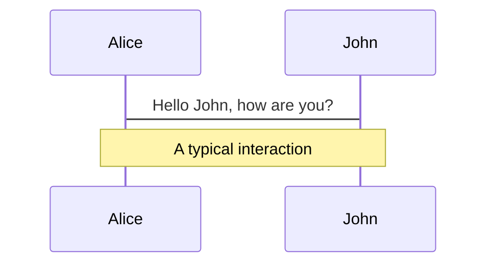
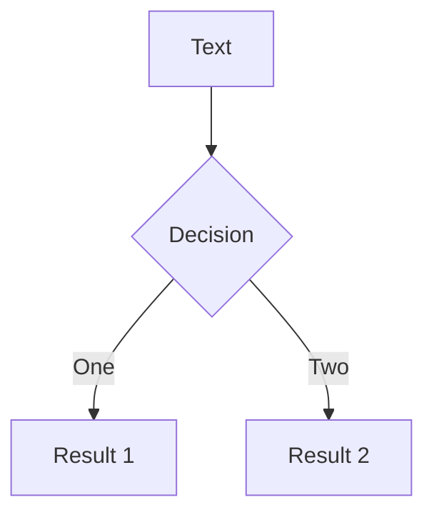
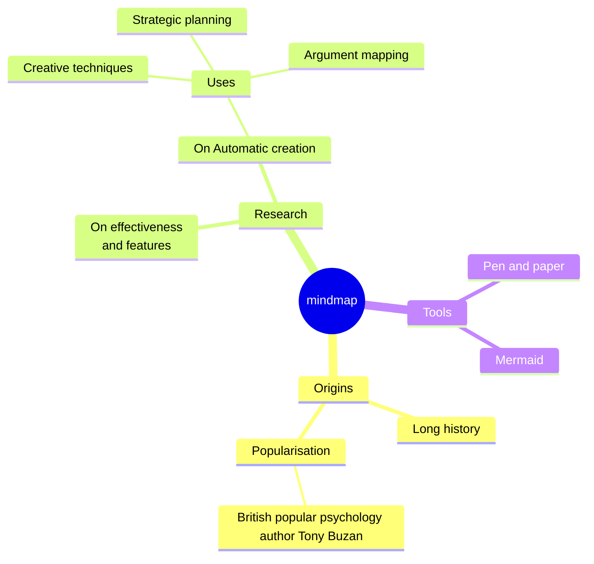
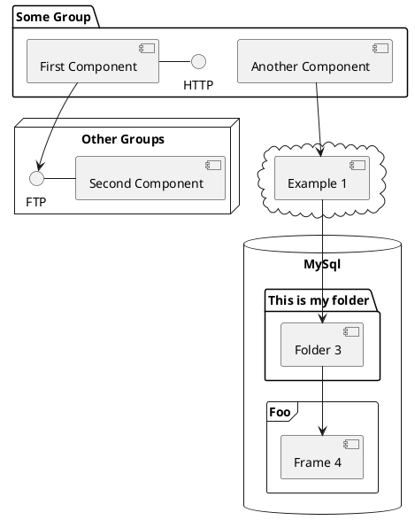

<div class="absolute inset-0 flex flex-col justify-center items-center">
  <h1 class="relative inline-flex items-center">
    <span class="text-black mr-2">🚀</span>
    <span class="bg-clip-text text-transparent" style="background-image: linear-gradient(123deg, #5e4eff 13.15%, #f14eff 88.72%);">
      LLM AI 应用的简单实现方法
    </span>
  </h1>
  <p class="pt-6">如何使用大语言模型 API 构建简单的 AI 应用</p>
</div>

---

<h1 class="relative inline-flex items-center">
  <span class="text-black mr-2">📱</span>
  <span class="bg-clip-text text-transparent" style="background-image: linear-gradient(123deg, #5e4eff 13.15%, #f14eff 88.72%);">
    大语言模型应用
  </span>
</h1>

> 大语言模型（LLM）是一种利用机器学习技术来理解和生成人类语言的人工智能模型。而大语言模型的 AI 应用则是基于这种模型构建的各种应用程序。

<ul class="py-4">
  <li>ChatGPT</li>
  <li>GitHub Copilot</li>
  <li>Notion AI</li>
  <li>...</li>
</ul>

为什么需要基于大语言模型的 AI 应用？

<ul class="pt-4">
  <li>提升生产力</li>
  <li>增强创作</li>
  <li>智能交互</li>
  <li>...</li>
</ul>

---

<h1 class="relative inline-flex items-center">
  <span class="text-black mr-2">🌐</span>
  <span class="bg-clip-text text-transparent" style="background-image: linear-gradient(123deg, #5e4eff 13.15%, #f14eff 88.72%);">
    大语言模型 API
  </span>
</h1>

<p class="pt-6">构建大语言模型 AI 最简单和快速的方式就是直接使用 AI 厂商提供的 API 服务。</p>

<p class="pt-6">常见的 LLM 服务 API 平台：</p>

<ul>
  <li><a href="https://platform.openai.com/docs/api-reference/introduction">OpenAI Platform</a></li>
  <li><a href="https://azure.microsoft.com/en-us/products/ai-services/openai-service">Azure OpenAI</a></li>
  <li><a href="https://ai.google.dev/gemini-api">Google Gemini</a></li>
  <li><a href="https://docs.anthropic.com/en/api/getting-started">Anthropic - Claude</a></li>
  <li><a href="https://platform.moonshot.cn/docs/api/chat#%E5%9F%BA%E6%9C%AC%E4%BF%A1%E6%81%AF">Kimi</a></li>
  <li>通义千问，文言一心</li>
  <li>...</li>
</ul>

---

<h1 class="relative inline-flex items-center">
  <span class="bg-clip-text text-transparent" style="background-image: linear-gradient(123deg, #5e4eff 13.15%, #f14eff 88.72%);">
    使用 OpenAI API
  </span>
</h1>

<p class="pt-6">我们可以通过使用任何语言的 HTTP 请求，或者利用其官方的 Python 包和 Node.js 库，甚至社区维护的库，与 Open AI 的大语言模型通过 API 来进行交互。</p>

OpenAI API 提供了多种功能：

- 文本生成 (Text Generation)
  - Chat Completions API
  - JSON Mode
- 函数调用 (Function Calling)
- 嵌入 (Embeddings)
- 微调 (Fine-tuning)
- 图像生成 (Image Generation)
- 视觉处理 (Vision)
- ...

---

<h1 class="relative inline-flex items-center">
  <span class="bg-clip-text text-transparent" style="background-image: linear-gradient(123deg, #5e4eff 13.15%, #f14eff 88.72%);">
    Chat Completions API
  </span>
</h1>

```shell {all|1|3|5|7-10|11-14} twoslash
curl https://api.openai.com/v1/chat/completions \
  -H "Content-Type: application/json" \
  -H "Authorization: Bearer $OPENAI_API_KEY" \
  -d '{
    "model": "gpt-3.5-turbo-16k",
    "messages": [
      {
        "role": "system",
        "content": "You are a helpful assistant."
      },
      {
        "role": "user",
        "content": "Hello!"
      }
    ]
  }'
```

<ExplainAPI :content="[
  '请求的 API 端点',
  '认证信息，API Key 配置在这里',
  '选择一个支持的大语言模型',
  '发送一条系统消息',
  '用户输入一条消息'
]" />

---

<h1 class="relative inline-flex items-center">
  <span class="bg-clip-text text-transparent" style="background-image: linear-gradient(123deg, #5e4eff 13.15%, #f14eff 88.72%);">
    Streaming
  </span>
</h1>

````md magic-move
```shell
curl https://api.openai.com/v1/chat/completions \
  -H "Content-Type: application/json" \
  -H "Authorization: Bearer $OPENAI_API_KEY" \
  -d '{
    "model": "gpt-3.5-turbo-16k",
    "messages": [
      {
        "role": "system",
        "content": "You are a helpful assistant."
      },
      {
        "role": "user",
        "content": "Hello!"
      }
    ]
  }'
```
```shell {all|16} twoslash
curl https://api.openai.com/v1/chat/completions \
  -H "Content-Type: application/json" \
  -H "Authorization: Bearer $OPENAI_API_KEY" \
  -d '{
    "model": "gpt-3.5-turbo-16k",
    "messages": [
      {
        "role": "system",
        "content": "You are a helpful assistant."
      },
      {
        "role": "user",
        "content": "Hello!"
      }
    ],
    "stream": true
  }'
```
````

<p v-click="[2]" class="pt-4">启用流模式后，消息将以增量方式发送，就像在 ChatGPT 中一样。数据会作为 <a href="https://developer.mozilla.org/en-US/docs/Web/API/Server-sent_events/Using_server-sent_events#Event_stream_format">Server-Sent Events(SSE)</a> 实时传送，每当有新的数据可用时就会发送。传输过程会以一个 <code>data: [DONE]</code> 消息结束。</p>

---
layout: two-cols
---

## Default Response

```json
{
  "id": "chatcmpl-123",
  "object": "chat.completion",
  "created": 1677652288,
  "model": "gpt-3.5-turbo-0125",
  "system_fingerprint": "fp_44709d6fcb",
  "choices": [{
    "index": 0,
    "message": {
      "role": "assistant",
      "content": "\n\nHello there, how may I assist you today?",
    },
    "logprobs": null,
    "finish_reason": "stop"
  }],
  "usage": {
    "prompt_tokens": 9,
    "completion_tokens": 12,
    "total_tokens": 21
  }
}
```

::right::

## Streaming Response

```json
{"id":"chatcmpl-123","object":"chat.completion.chunk","created":1694268190,"model":"gpt-3.5-turbo-0125", "system_fingerprint": "fp_44709d6fcb", "choices":[{"index":0,"delta":{"role":"assistant","content":""},"logprobs":null,"finish_reason":null}]}

{"id":"chatcmpl-123","object":"chat.completion.chunk","created":1694268190,"model":"gpt-3.5-turbo-0125", "system_fingerprint": "fp_44709d6fcb", "choices":[{"index":0,"delta":{"content":"Hello"},"logprobs":null,"finish_reason":null}]}

{"id":"chatcmpl-123","object":"chat.completion.chunk","created":1694268190,"model":"gpt-3.5-turbo-0125", "system_fingerprint": "fp_44709d6fcb", "choices":[{"index":0,"delta":{"content":"How are"},"logprobs":null,"finish_reason":null}]}

....

{"id":"chatcmpl-123","object":"chat.completion.chunk","created":1694268190,"model":"gpt-3.5-turbo-0125", "system_fingerprint": "fp_44709d6fcb", "choices":[{"index":0,"delta":{},"logprobs":null,"finish_reason":"stop"}]}
```

<style>
.grid {
  gap: 12px;
}
</style>

---

<h1 class="relative inline-flex items-center">
  <span class="bg-clip-text text-transparent" style="background-image: linear-gradient(123deg, #5e4eff 13.15%, #f14eff 88.72%);">
    常用配置
  </span>
</h1>

```json {all|2|3|4|5|6|7|8-21|all} twoslash
{
  "model": "gpt-4o",
  "temperature": 0.7,
  "max_tokens": 1500,
  "top_p": 1,
  "stream": true,
  "stop": ["\n\n"],
  "messages": [
    {
      "role": "system",
      "content": "你是一个帮助用户进行编程任务的 AI 助手。"
    },
    {
      "role": "user",
      "content": "我正在使用 JavaScript，请问如何定义一个箭头函数？"
    },
    {
      "role": "assistant",
      "content": "你可以使用以下语法定义一个箭头函数：\n\n```javascript\nconst myFunction = () => {\n  // 你的代码\n};\n```"
    }
  ]
}
```

<ExplainAPI :content="[
  '使用的模型，如 gpt-4o, gpt-4-turbo 等',
  '生成文本的随机性，较高的值使输出更随机，较低的值使输出更确定',
  '生成文本的最大令牌数',
  '核心采样，多样性控制',
  '启用流式输出',
  '停止生成的标志',
  '对话的消息列表。包含角色和内容，确保对话连贯性',
]" />

<style>
.explain-api {
  position: absolute;
  top: 7rem;
  right: 6rem;
}
</style>

---
layout: two-cols
---

## Python

```shell
pip install openai
```

```python
from openai import OpenAI

client = OpenAI()

stream = client.chat.completions.create(
    model="gpt-3.5-turbo",
    messages=[{"role": "user", "content": "Say this is a test"}],
    stream=True,
)
for chunk in stream:
    if chunk.choices[0].delta.content is not None:
        print(chunk.choices[0].delta.content, end="")
```

::right::

## Node.js / Typescript

```shell
npm install openai@^4.0.0
```

```javascript
import OpenAI from "openai";

const openai = new OpenAI();

async function main() {
    const stream = await openai.chat.completions.create({
        model: "gpt-3.5-turbo",
        messages: [{ role: "user", content: "Say this is a test" }],
        stream: true,
    });
    for await (const chunk of stream) {
        process.stdout.write(chunk.choices[0]?.delta?.content || "");
    }
}

main();
```

<style>
.grid {
  gap: 24px;
}
</style>
---

<h1 class="relative inline-flex items-center">
  <span class="bg-clip-text text-transparent" style="background-image: linear-gradient(123deg, #5e4eff 13.15%, #f14eff 88.72%);">
    使用本地 AI 服务
  </span>
</h1>

使用 Ollama 一键运行 Llama 3，并且内置提供了 API 服务。

```shell
# 使用 Ollama 运行 Llama 3 模型默认为 8B 参数版本
ollama run llama3

# 运行 Open WebUI，一个开源的 AI 聊天 UI 服务器
docker run -d -p 3000:8080 --add-host=host.docker.internal:host-gateway -v open-webui:/app/backend/data --name open-webui --restart always ghcr.io/open-webui/open-webui:main

# 使用本地的大语言模型 API
curl -X POST http://localhost:11434/api/generate -d '{
  "model": "llama3",
  "prompt":"Why is the sky blue?"
 }'
```

---


---

<h1 class="relative inline-flex items-center">
  <span class="bg-clip-text text-transparent" style="background-image: linear-gradient(123deg, #5e4eff 13.15%, #f14eff 88.72%);">
    Prompt 提示工程
  </span>
</h1>


此提示演示了如何有效使用每个构建块，从而产生高质量的输出。

---

<h1 class="relative inline-flex items-center mb-5">
  <span class="bg-clip-text text-transparent" style="background-image: linear-gradient(123deg, #5e4eff 13.15%, #f14eff 88.72%);">
    Demo: MQTTX Copilot
  </span>
</h1>

```javascript
const response = await fetch('https://api.openai.com/v1/chat/completions', fetchOptions)
if (response && response.status === 200 && response.ok) {
  const throttledScroll = throttle(() => {
    this.scrollToBottom()
  }, 500)
  const done = await processStream(response, (chunkStr) => {
    this.responseStreamText += chunkStr
    this.$nextTick(() => {
      Prism.highlightAllUnder(this.$refs.chatBody as HTMLElement)
      throttledScroll()
    })
  })
  if (done) {
    responseMessage.content = this.responseStreamText
    await copilotService.create(responseMessage)
    this.messages.push(responseMessage)
    this.$nextTick(() => {
      Prism.highlightAllUnder(this.$refs.chatBody as HTMLElement)
    })
  }
}
```

https://github.com/emqx/MQTTX/blob/main/src/components/Copilot.vue

---


---

<h1 class="relative inline-flex items-center mb-5">
  <span class="bg-clip-text text-transparent" style="background-image: linear-gradient(123deg, #5e4eff 13.15%, #f14eff 88.72%);">
    Demo: 使用 OpenAI Node.js SDK 构建一个 AI Agent
  </span>
</h1>

```javascript
// 获取用户位置
async function getLocation() {
  const response = await fetch("https://ipapi.co/json/");
  const locationData = await response.json();
  return locationData;
}

// 获取当前天气
async function getCurrentWeather(latitude, longitude) {
  const url = `https://api.open-meteo.com/v1/forecast?latitude=${latitude}&longitude=${longitude}&hourly=apparent_temperature`;
  const response = await fetch(url);
  const weatherData = await response.json();
  return weatherData;
}
```

---

```javascript
// 描述函数
const tools = [
  {
    type: "function",
    function: {
      name: "getCurrentWeather",
      description: "Get the current weather in a given location",
      parameters: {
        type: "object",
        properties: {
          latitude: { type: "string" },
          longitude: { type: "string" },
        },
        required: ["longitude", "latitude"],
      },
    }
  },
  {
    type: "function",
    function: {
      name: "getLocation",
      description: "Get the user's location based on their IP address",
      parameters: { type: "object", properties: {} },
    }
  },
];
```

---

# Clicks Animations

You can add `v-click` to elements to add a click animation.

<div v-click>

This shows up when you click the slide:

```html
<div v-click>This shows up when you click the slide.</div>
```

</div>

<br>

<v-click>

The <span v-mark.red="3"><code>v-mark</code> directive</span>
also allows you to add
<span v-mark.circle.orange="4">inline marks</span>
, powered by [Rough Notation](https://roughnotation.com/):

```html
<span v-mark.underline.orange>inline markers</span>
```

</v-click>

<div mt-20 v-click>

[Learn More](https://sli.dev/guide/animations#click-animations)

</div>

---

# Motions

Motion animations are powered by [@vueuse/motion](https://motion.vueuse.org/), triggered by `v-motion` directive.

```html
<div
  v-motion
  :initial="{ x: -80 }"
  :enter="{ x: 0 }"
  :click-3="{ x: 80 }"
  :leave="{ x: 1000 }"
>
  Slidev
</div>
```

<div class="w-60 relative">
  <div class="relative w-40 h-40">
    
    
    
  </div>

  <div
    class="text-5xl absolute top-14 left-40 text-[#2B90B6] -z-1"
    v-motion
    :initial="{ x: -80, opacity: 0}"
    :enter="{ x: 0, opacity: 1, transition: { delay: 2000, duration: 1000 } }">
    Slidev
  </div>
</div>

<!-- vue script setup scripts can be directly used in markdown, and will only affects current page -->
<script setup lang="ts">
const final = {
  x: 0,
  y: 0,
  rotate: 0,
  scale: 1,
  transition: {
    type: 'spring',
    damping: 10,
    stiffness: 20,
    mass: 2
  }
}
</script>

<div
  v-motion
  :initial="{ x:35, y: 30, opacity: 0}"
  :enter="{ y: 0, opacity: 1, transition: { delay: 3500 } }">

[Learn More](https://sli.dev/guide/animations.html#motion)

</div>

---

# LaTeX

LaTeX is supported out-of-box powered by [KaTeX](https://katex.org/).

<br>

Inline $\sqrt{3x-1}+(1+x)^2$

Block
$$ {1|3|all}
\begin{array}{c}

\nabla \times \vec{\mathbf{B}} -\, \frac1c\, \frac{\partial\vec{\mathbf{E}}}{\partial t} &
= \frac{4\pi}{c}\vec{\mathbf{j}}    \nabla \cdot \vec{\mathbf{E}} & = 4 \pi \rho \\

\nabla \times \vec{\mathbf{E}}\, +\, \frac1c\, \frac{\partial\vec{\mathbf{B}}}{\partial t} & = \vec{\mathbf{0}} \\

\nabla \cdot \vec{\mathbf{B}} & = 0

\end{array}
$$

<br>

[Learn more](https://sli.dev/guide/syntax#latex)

---

# Diagrams

You can create diagrams / graphs from textual descriptions, directly in your Markdown.

<div class="grid grid-cols-4 gap-5 pt-4 -mb-6">









</div>

[Learn More](https://sli.dev/guide/syntax.html#diagrams)

---

foo: bar
dragPos:
  square: 691,32,167,_,-16
---

dragPos:
  square: 0,-111,0,0
---

# Draggable Elements

Double-click on the draggable elements to edit their positions.

<br>

###### Directive Usage

```md

```

<br>

###### Component Usage

```md
<v-drag text-3xl>
  <carbon:arrow-up />
  Use the `v-drag` component to have a draggable container!
</v-drag>
```

<v-drag pos="663,206,261,_,-15">
  <div text-center text-3xl border border-main rounded>
    Double-click me!
  </div>
</v-drag>


###### Draggable Arrow

```md
<v-drag-arrow two-way />
```

<v-drag-arrow pos="67,452,253,46" two-way op70 />

---

src: ./pages/multiple-entries.md
hide: false
---

---

# Monaco Editor

Slidev provides built-in Monaco Editor support.

Add `{monaco}` to the code block to turn it into an editor:

```ts {monaco}
import { ref } from 'vue'
import { emptyArray } from './external'

const arr = ref(emptyArray(10))
```

Use `{monaco-run}` to create an editor that can execute the code directly in the slide:

```ts {monaco-run}
import { version } from 'vue'
import { emptyArray, sayHello } from './external'

sayHello()
console.log(`vue ${version}`)
console.log(emptyArray<number>(10).reduce(fib => [...fib, fib.at(-1)! + fib.at(-2)!], [1, 1]))
```

---

layout: center
class: text-center
---

# Learn More

[Documentations](https://sli.dev) · [GitHub](https://github.com/slidevjs/slidev) · [Showcases](https://sli.dev/showcases.html)
